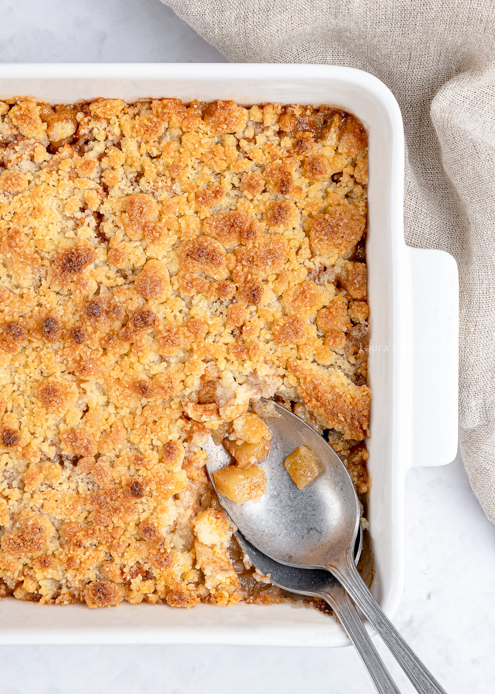

# Les.05
Dit is een oefening

## Test
APPEL CRUMBLE RECEPT
Appel crumble maken? Lekker! Met dit makkelijke recept heb je heel snel een heerlijke crumble met appel en kaneel op tafel staan.
PORTIES: 5 personen
Ronde ovenschaal Ø 24 cm of vierkant 20 x 20 cm
INGREDIËNTEN
APPEL VULLING
* 3 flinke appels
* 50 gram suiker
* 2 tl kaneel
CRUMBLE
* 75 gram ongezouten roomboter
* 100 gram bloem
* 100 gram suiker
* snuf zout

APPEL VULLING
1. Schil de appels en snij deze in blokjes. Meng suiker en kaneel door de appels en stort in de ovenschaal.
CRUMBLE MAKEN
1. Ik maak kruimeldeeg graag met mijn handen. Daarvoor doe je alle ingrediënten tegelijk in een kom. Wrijf de boter tussen je vingers fijn en kneed tot een stevig, maar kruimelig deeg.
2. Het deeg zal uiteindelijk net niet (of net wel) een stevig samenhangend deeg vormen. Dan is het goed. Strooi het kruimeldeeg over het appelmengsel.
APPEL CRUMBLE BAKKEN
1. Bak de apple crumble in 30 minuten op 200 °C (boven- en onderwarmte).
BEWAREN
Afgedekt in de koelkast 3 dagen houdbaar. Invriezen heb ik nog niet eerder gedaan, maar zou in een luchtdichte verpakking ook prima moeten kunnen.

